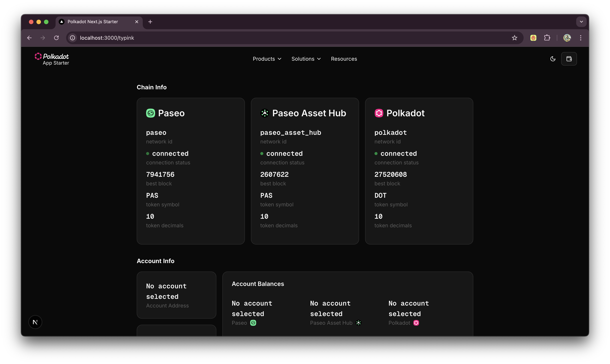

# Polkadot Next.js Starter (dedot + typink)

This project is a starter template for building frontend applications on the
Polkadot network using [dedot](https://dedot.dev) for interacting with polkadot
chains [typink](docs.dedot.dev/typink/) for client management and hooks and Next.js. It includes essential tools and configurations to streamline development.


[](https://vercel.com/new/clone?repository-url=https%3A%2F%2Fgithub.com%2Fniklasp%2Fpolkadot-nextjs-starter&project-name=polkadot-nextjs-starter&repository-name=polkadot-nextjs-starter&demo-title=Polkadot%20Next.js%20Starter%20&demo-description=A%20template%20to%20get%20started%20building%20apps%20powered%20by%20Polkadot&demo-url=https%3A%2F%2Fpolkadot-nextjs-starter.vercel.app&demo-image=https%3A%2F%2Fpolkadot-nextjs-starter.vercel.app%2Fpolkadot-nextjs-starter.png)

## Features

- Server rendered pages with client components where needed with**[Next.js 15.x](https://nextjs.org/docs/app/getting-started)**
- Modern, full-control react components with [shadcn ui](https://ui.shadcn.com/)
- Utility-first CSS with [Tailwind CSS 4.0](https://tailwindcss.com/)
  Data-fetching library for managing server state.
- Light and dark modes / theme management with [Next Themes](https://ui.shadcn.com/docs/dark-mode/next)

## Project Structure

- `app/`: Main application files including layout and page components.
- `components/`: Contains UI components like `PolkadotLogo`, `Footer`, and
  `Nav`.
- `providers/`: Context providers for themes, Polkadot extensions, and
  blockchain connections.
- `hooks/`: Example hooks with subscriptions.
- `lib/`: utility functions

## Installation

1. Clone the repository:

   ```bash
   git clone --branch typink https://github.com/niklasp/polkadot-nextjs-starter.git
   ```

2. Install dependencies:

   ```bash
   cd polkadot-nextjs-starter
   pnpm install
   ```

3. Run the development server:

   ```bash
   pnpm dev
   ```

## Contributing

Contributions are welcome! Please open an issue or submit a pull request for any
improvements or bug fixes.

## License

This project is open-source and available under the MIT License.
